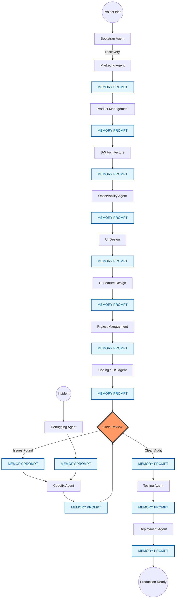

# 🚀 The SaaS Squad

This repository contains a high-fidelity, automated library of specialized AI agent prompts (The "SaaS Squad") designed for modern software development, architecture, and marketing. 

## 🌟 The Vision
The core philosophy of the SaaS Squad is **"Template-Driven Autonomy."** Instead of static prompts, these are dynamic templates that can be "bootstrapped" for any project by extracting context from a `README.md`. 

## 🚀 Getting Started (The Bootstrap Workflow)

The library features a **Bootstrap Agent** that automates the setup for a new project.

1. **Import the Library**: Copy the `.md` files into your project's `/agents` or `/.prompts` directory.
2. **Orchestrate**: Provide the `BOOTSTRAP_AGENT.md` (and your project's `README.md` if it exists) to an LLM.

### Starting from Scratch (Zero to One)
If you don't have a README yet, simply provide the `BOOTSTRAP_AGENT.md` and your product idea. The agent will move into **Discovery Mode**, acting as a senior technical consultant to help you define your tech stack, design philosophy, and core objectives through a brief interview.

### Ideal Project Context
To get the most out of the SaaS Squad, your project context (provided via `README.md` or the discovery interview) should ideally include:
- **Product Vision**: What are you building and why?
- **Core Tech Stack**: Frontend, Backend, DB, and Infrastructure.
- **Target Cloud Provider**: GCP or Azure.
- **Primary Persona**: Who is the main user of this system?
- **Revenue Model**: How do you make money? (e.g., "Subscription," "One-Time," "Credit-based").
- **Design Philosophy**: The "Vibe" (e.g., "Modern Industrial," "Liquid Glass," "Clean Minimalist").
- **Success Outcome**: What does "V1" look like?

3. **Customize**: The Bootstrap Agent will:
   - Extract/Discover project name, tech stack, and personas.
   - Audit for missing details and offer insightful suggestions.
   - Replace all `{{PLACEHOLDER}}` tags across the library.
   - Prepend a standardized **Project Parameters** block to every prompt.

## 🏗 building a SaaS from Scratch (Orchestration Workflow)

This library is designed for the end-to-end lifecycle of a SaaS product. **CRITICAL WORKFLOW**: To maintain the highest fidelity and prevent "persona contamination," you should **start a fresh chat session** whenever you switch between agents. Use the `MEMORY_PROMPT` to generate a state handoff before switching.

### THE CHAIN OF CUSTODY (Handoff & Loops)

The following diagram illustrates the high-fidelity handoff protocol and the mandatory quality gates enforced by the SaaS Squad.

Below is the recommended multi-agent orchestration workflow:

### Phase 1: Strategy & Definition
1. **[MARKETING_AGENT](file:///Users/mariog/Work/_agents/01_Strategy/MARKETING_AGENT.md)**: Define the market positioning, buyer personas, and GTM strategy.
2. **[PRODUCT_MGMT](file:///Users/mariog/Work/_agents/01_Strategy/PRODUCT_MANAGEMENT_AGENT.md)**: Transform the vision and user journeys into a high-fidelity PRD.

### Phase 2: Design & Architecture
3. **[SW_ARCHITECTURE](file:///Users/mariog/Work/_agents/02_Design/SW_ARCHITECTURE_AGENT.md)**: Take the PRD and design the system blueprint (ADD).
4. **[OBSERVABILITY](file:///Users/mariog/Work/_agents/04_Quality_Cloud/OBSERVABILITY_AGENT.md)**: Instrument the app for production-grade visibility (early design).
5. **[UI_DESIGN](file:///Users/mariog/Work/_agents/02_Design/UI_DESIGN_AGENT.md)**: Establish the visual identity and primary **{{DESIGN_PHILOSOPHY}}** layout.
6. **[UI_FEATURE_DESIGN](file:///Users/mariog/Work/_agents/02_Design/UI_FEATURE_DESIGN_AGENT.md)**: Create detailed blueprints (FDD) for specific functional components.

### Phase 3: Planning & Execution
6. **[PROJECT_MGMT](file:///Users/mariog/Work/_agents/03_Execution/PROJECT_MANAGEMENT_AGENT.md)**: Decompose the ADD/FDD into actionable, atomic development tickets.
7. **[CODING_AGENT](file:///Users/mariog/Work/_agents/03_Execution/CODING_AGENT.md)**: (or [IOS_SPECIALIST](file:///Users/mariog/Work/_agents/03_Execution/IOS_SPECIALIST_AGENT.md)) Implement the tickets using defensive TDD and project constants.

### Phase 4: Quality & Verification
9. **[CODE_REVIEW_AGENT](file:///Users/mariog/Work/_agents/04_Quality_Cloud/CODE_REVIEW_AGENT.md)**: Conduct adversarial audits of the code.
10. **[TESTING_AGENT](file:///Users/mariog/Work/_agents/03_Execution/TESTING_AGENT.md)**: Architect and execute E2E and integration test suites.
11. **[DEBUGGING_AGENT](file:///Users/mariog/Work/_agents/03_Execution/DEBUGGING_AGENT.md)**: Perform forensic audit and RCA for complex bugs.

### Phase 5: Deployment & Persistence
12. **Cloud Deployment**: Use [GCP_DEPLOYMENT](file:///Users/mariog/Work/_agents/04_Quality_Cloud/GCP_DEPLOYMENT_AGENT.md) or [AZURE_DEPLOYMENT](file:///Users/mariog/Work/_agents/04_Quality_Cloud/AZURE_DEPLOYMENT_AGENT.md) to deploy.
13. **[MEMORY_PROMPT](file:///Users/mariog/Work/_agents/05_Orchestration/MEMORY_PROMPT.md)**: Capture project "Gotchas" and hand off context.

## 📂 Agent Directory

| Agent | Specialized Role |
|-------|------------------|
| **[OBSERVABILITY](file:///Users/mariog/Work/_agents/04_Quality_Cloud/OBSERVABILITY_AGENT.md)** | SRE specializing in monitoring, tracing, and logs. |
| **[DEBUGGING](file:///Users/mariog/Work/_agents/03_Execution/DEBUGGING_AGENT.md)** | Forensic auditor for log analysis and RCA. |
| **[TESTING](file:///Users/mariog/Work/_agents/03_Execution/TESTING_AGENT.md)** | QA Lead for E2E, Integration, and Load testing. |
| **[HARDENING](file:///Users/mariog/Work/_agents/01_Strategy/HARDENING_AGENT.md)** | Principal Architect specializing in legacy codebase rescue. |
| **[BOOTSTRAP_AGENT](file:///Users/mariog/Work/_agents/BOOTSTRAP_AGENT.md)** | Orchestrator & Consultant. Prepares the library for a new project. |
| **[CODING_AGENT](file:///Users/mariog/Work/_agents/03_Execution/CODING_AGENT.md)** | Zero-Bug Principal Engineer focusing on defensive TDD. |
| **[CODE_REVIEW_AGENT](file:///Users/mariog/Work/_agents/04_Quality_Cloud/CODE_REVIEW_AGENT.md)** | Adversarial Auditor with context-aware scopes and locked file protection. |
| **[CODEFIX_AGENT](file:///Users/mariog/Work/_agents/03_Execution/CODEFIX_AGENT.md)** | Meticulous Senior Engineer for implementing audit remediations. |
| **[SW_ARCHITECTURE](file:///Users/mariog/Work/_agents/02_Design/SW_ARCHITECTURE_AGENT.md)** | Principal Architect focusing on trade-offs and AI-first infra. |
| **[IOS_SPECIALIST](file:///Users/mariog/Work/_agents/03_Execution/IOS_SPECIALIST_AGENT.md)** | Senior SwiftUI engineer following strict Apple HIG patterns. |
| **[GCP_DEPLOYMENT](file:///Users/mariog/Work/_agents/04_Quality_Cloud/GCP_DEPLOYMENT_AGENT.md)** | DevOps Specialist providing Terraform-first runbooks. |
| **[AZURE_DEPLOYMENT](file:///Users/mariog/Work/_agents/04_Quality_Cloud/AZURE_DEPLOYMENT_AGENT.md)** | Azure Specialist using Bicep and `azd` for cloud-native deployments. |
| **[PRODUCT_MGMT](file:///Users/mariog/Work/_agents/01_Strategy/PRODUCT_MANAGEMENT_AGENT.md)** | Principal PM translating ambiguity into high-fidelity PRDs. |
| **[PROJECT_MGMT](file:///Users/mariog/Work/_agents/03_Execution/PROJECT_MANAGEMENT_AGENT.md)** | TPM specializing in ADD/FDD decomposition into development tickets. |
| **[UI_DESIGN](file:///Users/mariog/Work/_agents/02_Design/UI_DESIGN_AGENT.md)** | Elite designer focused on emotional UX and modern aesthetics. |
| **[UI_FEATURE_DESIGN](file:///Users/mariog/Work/_agents/02_Design/UI_FEATURE_DESIGN_AGENT.md)** | Systematic designer creating blueprints for features. |
| **[GROWTH_AGENT](file:///Users/mariog/Work/_agents/01_Strategy/GROWTH_AGENT.md)** | Conversion expert specializing in high-impact landing pages. |
| **[PAYMENTS_AGENT](file:///Users/mariog/Work/_agents/03_Execution/PAYMENTS_AGENT.md)** | Stripe Specialist for secure subscriptions and billing. |
| **[MARKETING_AGENT](file:///Users/mariog/Work/_agents/01_Strategy/MARKETING_AGENT.md)** | Expert Strategist for GTM, SEO, and branding. |
| **[MEMORY_PROMPT](file:///Users/mariog/Work/_agents/05_Orchestration/MEMORY_PROMPT.md)** | Context handoff specialist for long-running sessions. |

## 🤝 The Handoff Protocol
The SaaS Squad is designed to be self-navigating. You don't need to memorize the workflow:
- **Guided Directives**: Every agent ends their session with a `## Next Steps` section.
- **Explicit Instructions**: They will tell you exactly which agent to call next and which files/context to carry over.
- **Mission Roadmap**: The `BOOTSTRAP_AGENT` provides a primary "Flight Plan" tailored to your project upon initialization.

## 🚀 Standard Workflows (SOPs)
The SaaS Squad comes with built-in Standard Operating Procedures. You can trigger these workflows directly:

1.  **[Idea to PRD](file:///Users/mariog/Work/_agents/.agent/workflows/idea-to-prd.md)**: Zero-to-one strategy and requirements.
2.  **[PRD to Blueprint](file:///Users/mariog/Work/_agents/.agent/workflows/prd-to-blueprint.md)**: Turning requirements into architecture and UI plans.
3.  **[Implementation Loop](file:///Users/mariog/Work/_agents/.agent/workflows/implementation-loop.md)**: The core cycle of ticketing, coding, and auditing.
4.  **[Deploy & Persist](file:///Users/mariog/Work/_agents/.agent/workflows/deploy-and-persist.md)**: Moving code to the cloud and updating project memory.
5.  **[Monetization Loop](file:///Users/mariog/Work/_agents/.agent/workflows/monetization-loop.md)**: Building your revenue engine with Stripe.
6.  **[Observability Loop](file:///Users/mariog/Work/_agents/.agent/workflows/observability-loop.md)**: How to instrument and monitor your app.
7.  **[Debug-Fix Loop](file:///Users/mariog/Work/_agents/.agent/workflows/debug-fix-loop.md)**: Structured sequence for fixing production bugs.
8.  **[Hardening Loop](file:///Users/mariog/Work/_agents/.agent/workflows/hardening-loop.md)**: How to inherit and stabilize an existing codebase.

---

## 🛠 Advanced Features

### Locked Files Protection
The `CODE_REVIEW_AGENT` monitors a `.lockedfiles` manifest in the project root. This is a plain text file containing one relative path per line. Any modifications to files listed in this manifest are flagged as a **CRITICAL SECURITY WARNING**, ensuring architectural integrity of audited or sensitive code.

### Adaptable Review Scopes
Unlike generic reviews, the `CODE_REVIEW_AGENT` supports three distinct modes:
- `SCOPE: DIFF`: Pre-commit incremental review.
- `SCOPE: FILE(S)`: Targeted deep-dives.
- `SCOPE: REPO`: Holistic architectural audits.

## 🔄 Session Continuity & State Persistence

For long-running projects or when switching between specialized agents (e.g., from PM to Architect), maintaining context is critical. This library provides a specialized **`MEMORY_PROMPT.md`** to handle state handoffs across session boundaries.

### Why Fresh Sessions?
Mixing specialized agents in a single long chat session can lead to "persona drift" and logic regressions as the LLM's context window fills with conflicting instructions. Starting a fresh session for each major task ensures the agent stays 100% focused on its specific role and rules.

### The Memory Workflow
1. **End-of-Session Handoff**: At the end of a session, use the `MEMORY_PROMPT.md` to generate a `SESSION_MEMORY.md` file (typically in `.tmp/` or a specialized project directory).
2. **Context Compression**: The prompt directs the agent to summarize:
   - Architectural decisions.
   - Critical "Gotchas" and non-obvious discoveries.
   - Current Git state and pending tasks.
3. **Resuming Work**: When starting a new session, provide the `SESSION_MEMORY.md` to the agent first. This ensures the agent "remembers" where it left off, avoiding repetitive research and preventing logic regressions.

## 📜 Best Practices
- **Explicit README**: The better your project README, the more precise the Bootstrap Agent will be.
- **Maintain consistency**: Use the `MEMORY_PROMPT` to pass context between long interactions.
- **Review before merge**: Always run the `CODE_REVIEW_AGENT` on significant diffs.

---
*Built with ❤️ for advanced agentic coding workflows.*
